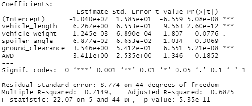

# MechaCar_Statistical_Analysis

## Summary of Statistical Outcomes

### Linear Regression to Predict MPG: 
Based on the outputs of a multiple linear regression model (image below), the following can be concluded: 
- There is a medium/strong correlation between data collected (vehicle length, vehicle weight, spoiler angle, ground clearance, and AWD) and MPGs of the MechaCar. The R squared value is 0.68 with greater than 0.7 signifying a strong correlation and less than 0.7 signifying a medium correlation.
- The two variables impacting MPGs the most are vehicle length and ground clearance due to their low p-values (<0.05).

### Summary Statistics on Suspension Coils:

### t-Test on Suspension Coils: 

### Design a Study to Compare the MechaCar to the Competition: 
