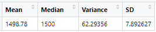
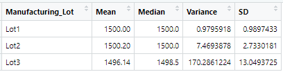
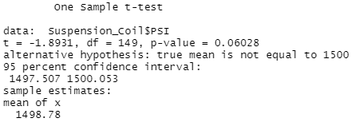
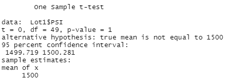
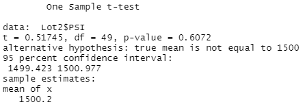
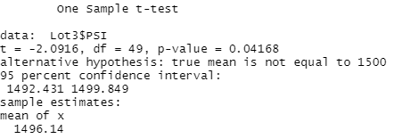

# MechaCar_Statistical_Analysis

## Summary of Statistical Outcomes

### Linear Regression to Predict MPG: 
Based on the outputs of a multiple linear regression model (image below), the following can be concluded: 
- There is a medium/strong correlation between data collected (vehicle length, vehicle weight, spoiler angle, ground clearance, and AWD) and MPGs of the MechaCar. The R squared value is 0.68 with greater than 0.7 signifying a strong correlation and less than 0.7 signifying a medium correlation.
- The two variables impacting MPGs the most are vehicle length and ground clearance due to their low p-values (<0.05).

### Summary Statistics on Suspension Coils:

In comparing the PSI that each vehicle's suspension coils could handle, it is clear that there is the most variability from Lot 3 of the manufacturing plant. The variance of both lot 1 and 2 is less than 0.5% of the mean PSI. Whereas, the variability in lot 3 is over 11% of the mean PSI. 

Additionally, the mean and median PSI of lot 3 is slightly lower than lot 1, lot 2, and the total of the lots. This indicates that the data for lot 3 is skewed slightly left and may have a few suspension coils that are measuring at less than the ~1500 PSI (mean and median) of the other two lots.

Total Summary

Lot Summary

### t-Test on Suspension Coils: 

A sample t-test was used to learned whether the means of the total sample and each lots sample (1, 2, and 3) were statistically different than the mean of the population, 1,500 PSI. The results are as follows and can be visualized in the images below as well: 
- Total Sample: There is no statistical difference between the mean of the population and the mean of this sample. 

- Lot 1 Sample: The mean of this sample is 1,500 PSI, which is equal to the population, so there is no statistical difference between the mean of Lot 1 and the mean of the population. This is further shown with the p-value of 1. 

- Lot 2 Sample: There is no statistical difference between the mean of the population and the mean of this sample. 

- Lot 3 Sample: There is a statistically significant difference in the mean of the population and the mean of this sample. this further supports the evidence of skew discussed in the previous section.

### Study Design: MechaCar vs. Competition

